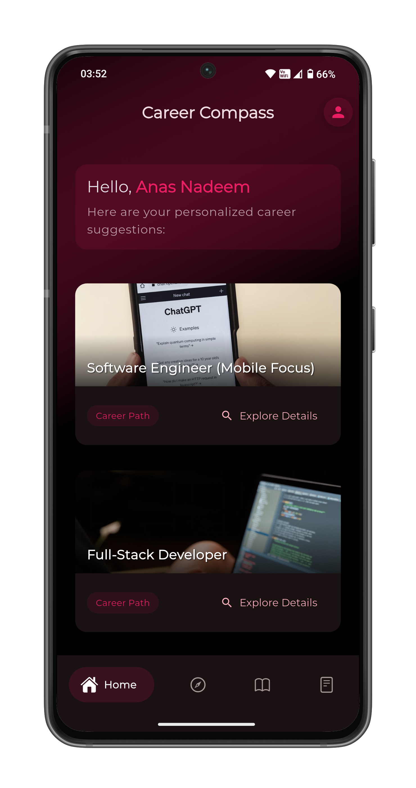
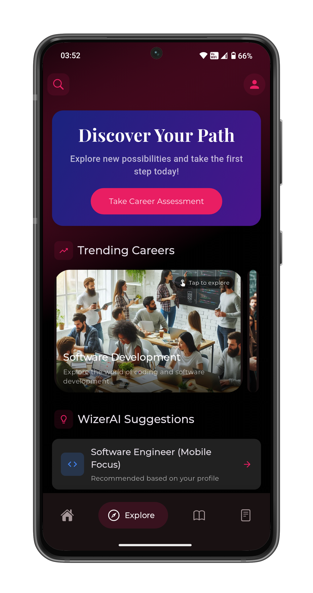

# WizerAI 🎓🤖  
*Your AI-Powered Career Companion*

---

## 📽️ Overview

WizerAI is an intelligent career counseling application designed to guide users towards the right career paths based on their interests, skills, and personality. Using advanced AI models, it offers personalized recommendations, career resources, and interactive guidance to help users make informed career decisions.

🔗 **Intro Video**: [Watch Here]([https://youtube.com/shorts/RbVHbEclNJg])

---

## ✨ Features

- 🔍 **Career Exploration** — Discover careers based on your interests and personality.
- 🤖 **AI Career Chatbot** — Chat with a smart assistant for career queries and suggestions.
- 🧠 **Personalized Career Match** — Get career recommendations after a quick survey.
- 📊 **Skill Level Assessments** — Assess your strengths with MCQs and reasoning quizzes.
- 📚 **Resource Hub** — Access curated resources and guides for your chosen career.
- 🔐 **Authentication** — Secure user login & data storage via Supabase.
- 🌐 **Cross-Platform** — Built with Flutter, works on Android, iOS, and Web.

---

## 🛠️ Technology Stack

- **Frontend**: Flutter
- **Backend Services**: Supabase
- **AI Services**: Gemini API

---

## 🖼️ Screenshots

### 📱 Page 1 – Career Match Result


### 💬 Page 2 – AI Career Chatbot


---

## 🔑 Key Technologies

| Tech         | Purpose                          |
|--------------|----------------------------------|
| Flutter      | Cross-platform frontend UI       |
| Supabase     | Auth + Secure user management    |
| Hive DB      | Caching                          |
| Google Gemini| Career insights and text AI      |

---

## 🚀 Getting Started

To run the project locally:

### 📦 Prerequisites

- Flutter SDK
- Node.js
- MongoDB (local or Atlas)
- Supabase account
- OpenAI API key

### ⚙️ Steps

1. **Clone the repo**

```bash
git clone https://github.com/your-username/wizerai.git
cd wizerai
