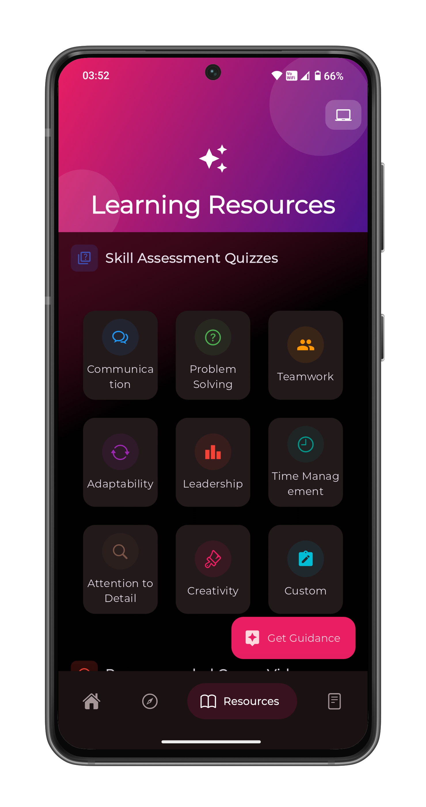
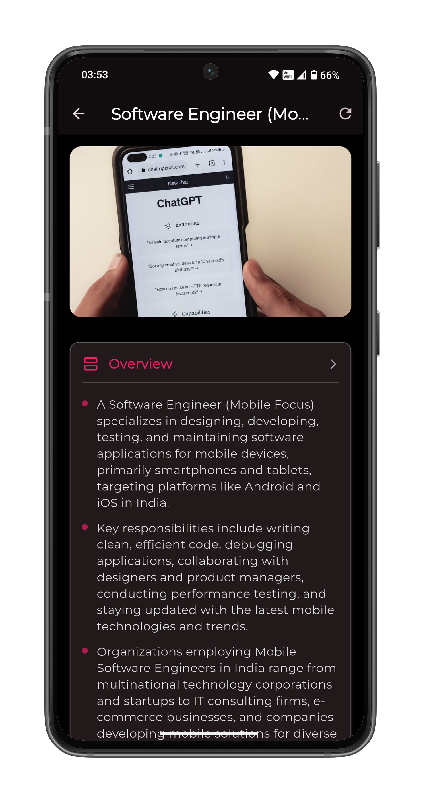
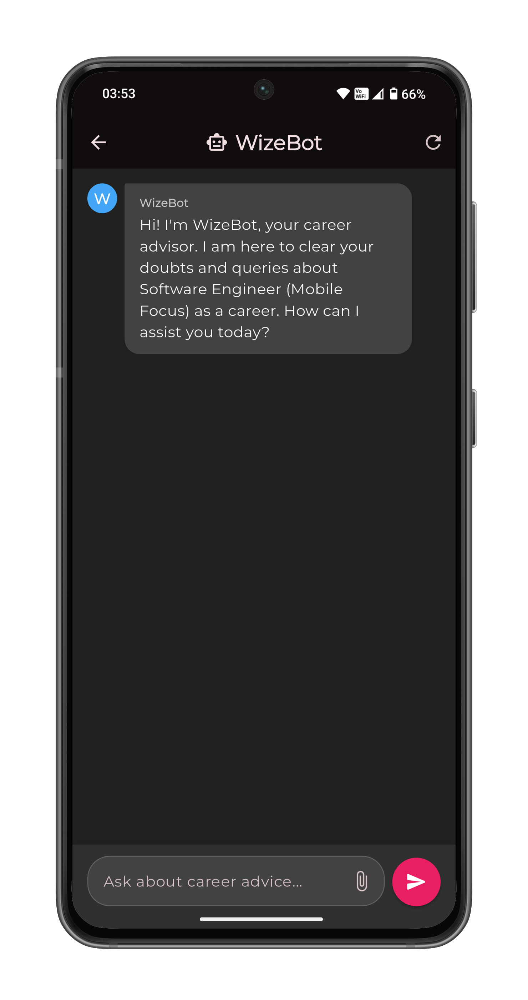
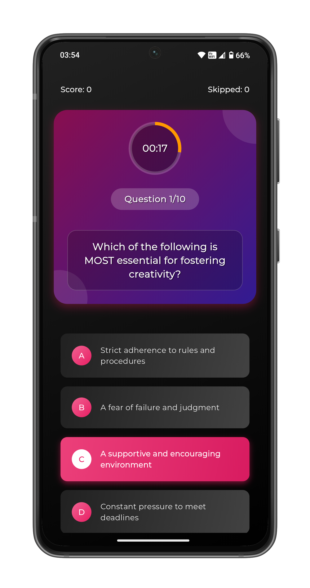
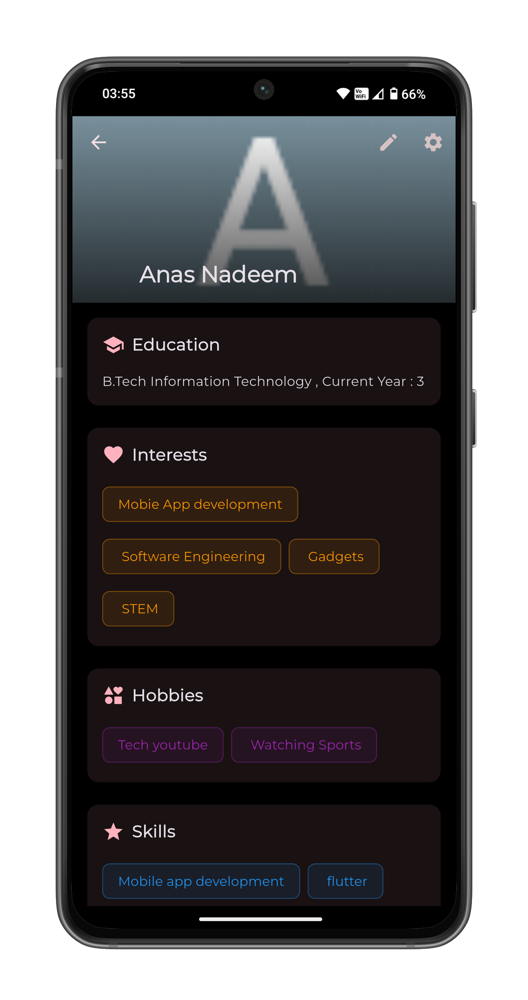

# WizerAI 🎓🤖  
*Your AI-Powered Career Companion*

---

## 📽️ Overview

WizerAI is an intelligent career counseling application designed to guide users towards the right career paths based on their interests, skills, and personality. Using advanced AI models, it offers personalized recommendations, career resources, and interactive guidance to help users make informed career decisions.

🔗 **Intro Video**: [Watch Here](https://youtube.com/shorts/RbVHbEclNJg)

---

## ✨ Features

- 🔍 **Career Exploration** — Discover careers based on your interests and personality.
- 🤖 **AI Career Chatbot** — Chat with a smart assistant for career queries and suggestions.
- 🧠 **Personalized Career Match** — Get career recommendations after a quick survey.
- 📊 **Skill Level Assessments** — Assess your strengths with MCQs and reasoning quizzes.
- 📚 **Resource Hub** — Access curated resources and guides for your chosen career.
- 🔐 **Authentication** — Secure user login & data storage via Supabase.
- 🌐 **Cross-Platform** — Built with Flutter, works on Android, iOS, and Web.

---

## 🛠️ Technology Stack

- **Frontend**: Flutter
- **Backend Services**: Supabase
- **AI Services**: Gemini API

---

## 📱 Screenshots

### 🏠 Home Page – Career Recommendations

### 🧭 Explore Page – Explore Suggested and other Careers

### 📖 Resources Page – Learning Resources

### 👨🏻‍💼 Career Details Page – Details about a specific Career

### 🤖 AI Chatbot – Clear Doubts and Queries

### ❓ MCQ Quiz – Assess your skills

### 👨🏻 Profile Page – View and Edit your Personal Details

---

## 🔑 Key Technologies

| Tech         | Purpose                          |
|--------------|----------------------------------|
| Flutter      | Cross-platform frontend UI       |
| Supabase     | Auth + Secure user management    |
| Hive DB      | Caching                          |
| Google Gemini| Career insights and text AI      |
